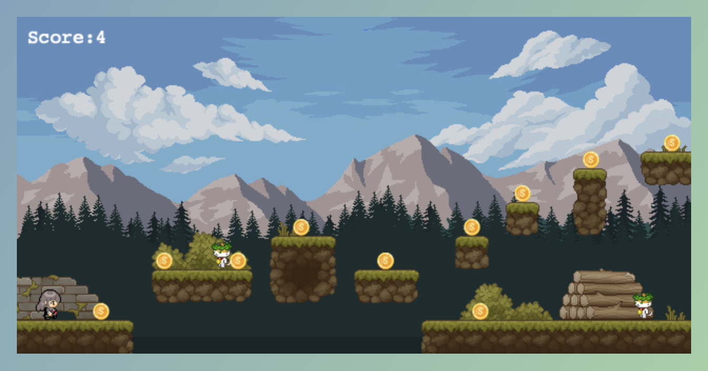

# Games developed based on Phaser

**作品名稱：** 類瑪利歐的闖關遊戲
	
**動機：** 此作品主要致敬過往孩時，曾熱衷Platformer Games，也好奇製作方式，而興起該遊戲製作。

**開發環境：** Phaser(主要是運用Javascript進行開發)

**遊戲解說：** 進行遊戲過程，必須避開敵人，並吃足夠金幣，直到地圖的尾聲，方可闖關成功。

 

	

 

**學習資源：** 參考以下的教學網站：
<a href="https://connectshark.github.io/Phaser3/progressBar.html" title="Learning resources">Learning resources by NoseGates</a>

**遊戲圖檔：** 圖檔來源，主要來自於以下幾個：
1. 金幣：<a href="https://www.flaticon.com/free-icons/coin" title="Coin image">Coin icons created by NajmunNahar - Flaticon</a>
2. 人物：<a href="https://twitter.com/pipohi" title="Tileset image">Character design source by ぴぽ (@pipohi)(下載於ChatDev IDE的GitHub，但圖片來源自Generative Agents: Interactive Simulacra of Human Behavior論文的GitHub，根據該網站說明，為藝術家ぴぽ (@pipohi)提供(根據論文網站的Apache-2.0 license使用))</a>
3. 物件：<a href="https://cainos.itch.io/pixel-art-platformer-village-props" title="Tileset image">Object image source by Cainos</a>
3. 背景：<a href="https://sanctumpixel.itch.io/forest-lite-pixel-art-tileset" title="Tileset image">Background image source by Sanctumpixel</a>

**操作方式：** 遊戲操作方式，是透過鍵盤左右間移動，按下空白鍵可以進行跳躍。
